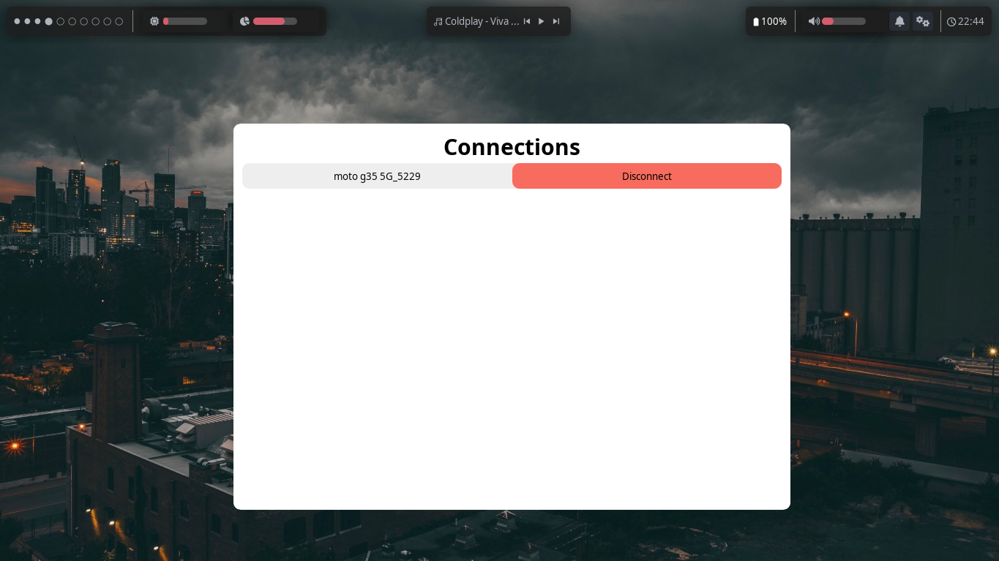

# EWifi GUI Template

This is a simple, easy-to-use Wi-Fi manager template for **Ewwii**, made for Linux desktops with `nmcli` installed. It comes with a custom GTK CSS theme and demonstrates many of the advanced features available in Ewwii, making it a great starting point for building your own Wi-Fi manager or experimenting with Ewwii widgets.

## Installation

Just run the following command and have the template ready in the current working directory!

```bash
$ eiipm install ewifi_gui_template
```

## Screenshot


